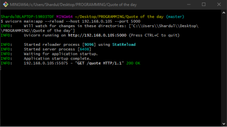
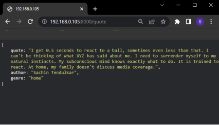

# Quote-Of-The-Day-API

This is an API made to serve as a resource for another project to be made in future. The API is built using Fast API which is a modern, fast (high-performance), web framework for building APIs.

## Importing Libraries
We import all the required libraries for this project. `Linecache` is a module that allows one to get any line from a Python source file. It is used here to extract a line from the csv file. The `random` modeule is used to generate a random integer which will be used to select a random line number from the csv file. The `FastAPI` module is used to create an API.
```Python
import linecache, random
from fastapi import FastAPI
```

## Creating the FastAPI object
We initialize a FastAPI application using the `FastAPI()` class to which we can start assigning the routes, using the app object.
```Python
app = FastAPI()
```

## Adding Routes
An API has `Endpoints` or as we say `Routes` through which the user requests and the data corresponding to the requested route is served to the user. The routes are assigned to the `app` instance.

## The Home Route
We define the routes for the API using the `app` instance that we have created in the prrevious step. Here we have used `GET` method since we are not passing any sensitive data. Using the `@app.get("/")`  decorator we define an HTTP GET endpoint for the root path ("/") of our API and set it to return a message of value "Route works" with a name of "home" as the JSON name-value pair.
```Python
@app.get("/")
def home():
    return {"home": "Route works"}
```

## The Quote Route
This is the route that supplies the quotes. The quotes are extracted from the `quotes.csv` file. We initialise the route using the decorator `@app.get("/quote")`. To start off we count the number of lines from the file. We then initialise a list that contains the random line from the csv file and then remove the stray "/n" charater. Since the line contains the Quote, the Author's name and the Genre, all separated by a semicolon(;), we split the line into 3 parts and store it into a list format. We then create the Quote, Author and Genre variables and then assign them their respective contents using list indexing and then return the contentsb in JSON format with their respective name-value pair syntax.
```Python
@app.get("/quote")
def newQuote():
    with open("Quotes.csv") as fp:
        No_of_Lines = len(fp.readlines())

    quote_list = linecache.getline("Quotes.csv", random.randint(0, No_of_Lines), module_globals=None).strip("\n").split(";")

    quote = quote_list[0]
    author = quote_list[1]
    genre = quote_list[2]

    return {"quote": quote, "author": author, "genre": genre}
```

## Starting the app
To start this API we go to the commnd line(I have used Git CLI) and enter the following line
```Shell
uvicorn main:app --reload --host 192.168.0.105 --port 5000
```

## Project in Action 
<p align=center>
  
  <p align=center>Command Line</p>
</p>

<p align=center>
  
  <p align=center>API response</p>
</p>